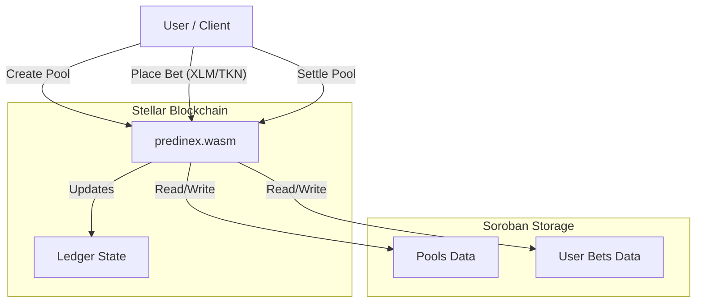
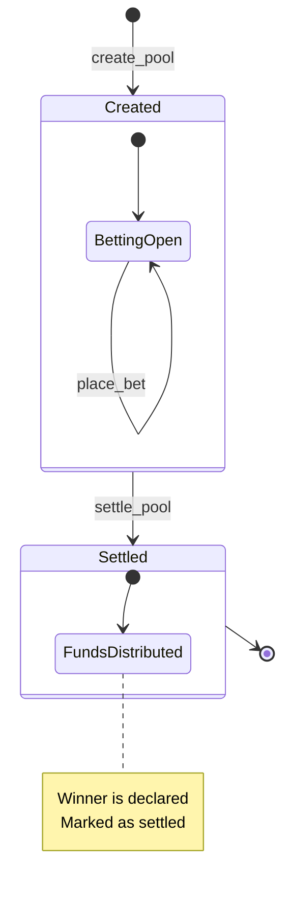

# Predinex Stellar

> Next-generation prediction markets on Stellar (via Soroban).


   

## 🏗 System Architecture

The project centers around the `predinex`,  Soroban smart contract which manages pool states, betting logic, and fund distribution. It utilizes the Stellar Asset Contract (SAC) for secure token transfers.



## 🔄 Workflow

The prediction market lifecycle on Stellar is designed for speed and finality.



## ✨ Features

- **Decentralized Prediction Pools**: Create and manage binary outcome markets with ease.
- **Fast Settlements**: Leverages Stellar's 5-second finality for rapid results.
- **Cross-Asset Betting**: Compatible with any Stellar asset via the Stellar Asset Contract (SAC).
- **Automated Bookkeeping**: Real-time tracking of pool totals and user positions.
- **Robust Security**: Built with Rust and Soroban's secure-by-design architecture.
- **Transparency**: Fully verifiable on-chain data and transaction history.

## 🚀 Getting Started

### Prerequisites

- [Rust](https://www.rust-lang.org/)
- [Stellar CLI](https://developers.stellar.org/docs/build/smart-contracts/getting-started/setup#install-the-stellar-cli)
- [Node.js](https://nodejs.org/) (v18+)

### Installation

1. **Clone the repository**
   ```bash
   git clone <repository-url>
   cd predinex-stellar
   ```

2. **Quick Start (Recommended)**

   Run the bootstrap script to install all dependencies and verify your environment:
   ```bash
   ./scripts/bootstrap.sh
   ```

3. **Build the Contract**
   ```bash
   cd contracts/predinex
   stellar contract build
   ```

4. **Run Tests**
   ```bash
   cargo test
   ```

## 🛣️ Roadmap to Launch

Predinex Stellar follows a phased approach to bring a premium betting experience to the ecosystem.

### Phase 1: Core Soroban Implementation (COMPLETED)
- ✅ Core contract logic (Pools, Bets, Settlement).
- ✅ Unit test suite for full lifecycle verification.
- ✅ Token integration (SAC).

### Phase 2: Frontend Migration (IN PROGRESS)
- 🔄 Stellar SDK integration.
- 🔄 Freighter wallet support.
- ⏳ Real-time market tracking on Stellar.

## 🤝 Contributing & Releases

We welcome contributions! Please see our development guides for more information:
- [Local End-to-End Runbook](./docs/local-runbook.md) — build the contract, deploy to testnet, and wire the web app from a clean checkout
- [Frontend Development](./web/DEVELOPMENT.md)
- [Release Process](./RELEASE.md)

## 🛠️ CI/CD Pipeline

The project uses GitHub Actions to ensure code quality and prevent regressions. The workflow runs on every push and pull request to `main`.

### Local Verification

You can run the same checks locally to verify your changes before pushing:

**Web App:**
```bash
cd web
npm run lint
npm run test
npm run build
```

**Smart Contracts:**
```bash
cd contracts/predinex
cargo fmt
cargo fmt --check
cargo clippy -- -D warnings
cargo test
```

---

## 📄 License

This project is licensed under the ISC License.
